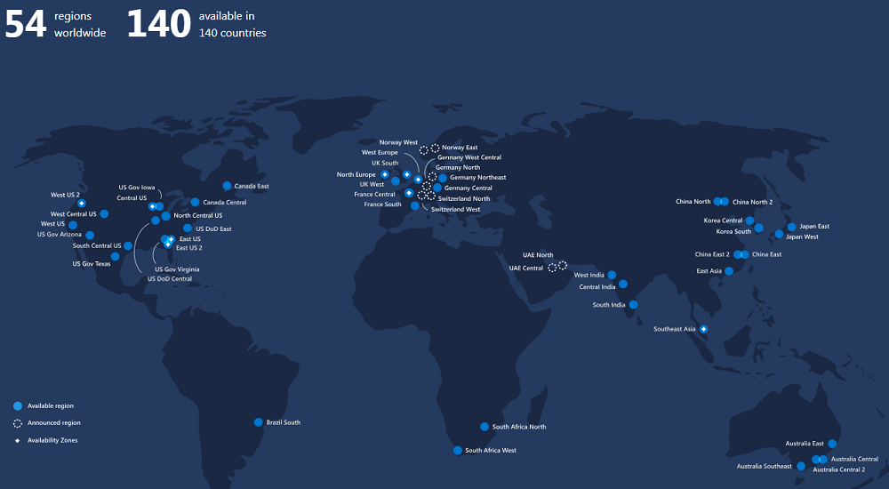

# AZ-300 Azure Architecture Technologies Certification Exam

## Introduction & Pre-Requisite
This is a summarized document created during my learning time, for quick reference and some of the topics/items are very high-level. If anyone else using this document, I assume you have some basic idea about cloud computing and the way how it is working. (I didn't cover any basic cloud computing notes here; you may request for the same though.)

  * [Introduction & Pre-Requisite](#introduction---pre-requisite)
  * [1. Quick Start](#1-quick-start)
  * [2. Inside AZ300](#2-inside-az300)
    + [2.6. Note About AZ-300 Content](#26-note-about-az-300-content)
    + [2.7 Exam Overview](#27-exam-overview)
    + [2.8 Exam Changes](#28-exam-changes)
    + [2.9 Multi-Channel Learning](#29-multi-channel-learning)
    + [2.10 Azure Hands-on Labs](#210-azure-hands-on-labs)
      - [Azure Citadel](#azure-citadel)
  * [3. Overview of Azure](#3-overview-of-azure)
    + [3.11 Different Services in Azure](#311-different-services-in-azure)
    + [3.14 Azure Goes and Regions](#314-azure-goes-and-regions)
      - [54 Regions](#54-regions)
  * [4. AZ-300 Create and Configure Virtual Machines](#4-az-300-create-and-configure-virtual-machines)
    + [4.16 What is a Virtual Machines](#416-what-is-a-virtual-machines)
      - [6 Categories of Instances](#6-categories-of-instances)
    + [4.17 Azure Portal](#417-azure-portal)
    + [4.18 Create Virtual Machine](#418-create-virtual-machine)
    + [4.20 Learn How to Cleanup VM](#420-learn-how-to-cleanup-vm)
    + [4.21 Configure VM for Availability](#421-configure-vm-for-availability)
      - [Availability Zone](#availability-zone)
      - [Availability Set](#availability-set)
      - [Fault Domain](#fault-domain)
      - [Update Domains - #ToBeRead](#update-domains----toberead)
    + [4.22 Monitoring VM](#422-monitoring-vm)
      - [Diagnostics Settings](#diagnostics-settings)
    + [4.23 Virtual Machine Scale Set](#423-virtual-machine-scale-set)
  * [5. Automate Deployment of VM](#5-automate-deployment-of-vm)
  * [6. Virtual Machine - Encryption](#6-virtual-machine---encryption)
    + [Key Vault](#key-vault)
  * [7. Analyze Resource Utilization & Consumption](#7-analyze-resource-utilization---consumption)
  * [Appendix](#appendix)

## 1. Quick Start
New exam in 2019 - AZ-300 and AZ-301
70-535 - Already retired in 2018 and need to take AZ-302 (Transition Exam)

## 2. Inside AZ300
### 2.6. Note About AZ-300 Content
*Read Later*
	
### 2.7 Exam Overview
* 25-30% Questions from "Deploy and Configure Infrastructure"
* 25-30% Workload and Security
* 5-10% Create and Deploy Apps
* 5-10% Implement Authentication and Secure Data
* 20-25% Develop for the Cloud

### 2.8 Exam Changes
* Role based certifications
* 40-60 Questions
* 2.5 hr exam
* Performance based testing - Live tasks
* 7-9 tasks to perform
		
### 2.9 Multi-Channel Learning
* Microsoft Learn portal - https://docs.microsoft.com/en-us/learn/
* Microsoft handsonlabs - https://www.microsoft.com/handsonlabs/
* Microsoft Documentation - https://docs.microsoft.com/en-us/azure/
* Azure Code Samples : https://azure.microsoft.com/en-us/resources/samples/?sort=0

### 2.10 Azure Hands-on Labs
#### Azure Citadel
Hands-on Labs collection by Community - https://azurecitadel.com/

## 3. Overview of Azure
### 3.11 Different Services in Azure

### 3.14 Azure Goes and Regions
2010 Feb : Released Windows Azure
2014 Mar : Microsoft Azure

#### 54 Regions
Refer [Regions](https://azure.microsoft.com/en-us/global-infrastructure/regions/) for latest details.

## 4. AZ-300 Create and Configure Virtual Machines

### 4.16 What is a Virtual Machines

#### 6 Categories of Instances
* General Purpose - B,D,DS,A,DC
* Compute Optimized (High CPU-Memory Ratio) - F, FS
* Memory Optimized - E, ES, M, G, GS, D*, DS*
* Storage Optimized (High Disk throughput and IO) - LS
* GPU (For Graphics Rendering) - NV, NC, ND
* High Performance Compute - H

(*S Stands for SSD ?)

### 4.17 Azure Portal
> Explore Azure Portal and interface

### 4.18 Create Virtual Machine
> Explore by creating a VM, test access, login and play around

### 4.20 Learn How to Cleanup VM
Make sure you have cleaned all resources not just the VM, during learning. Better goto resource groups and delete resource group itself so that all other items like network, disk etc will get deleted together with VM.

### 4.21 Configure VM for Availability
Availability Set Vs Availability Zone - #ToBeRead

#### Availability Zone
Not available on all regions.

#### Availability Set
Grouping one or more VMs in Availability Set to ensure atleast one is available during maintenance or unplanned outage. 

#### Fault Domain
Distribute VM to different physical compute resources.

#### Update Domains - #ToBeRead

### 4.22 Monitoring VM
#### Diagnostics Settings
* Enable Diagnostics Settings for the VM
* We can enable log analytics
* Explore Metrics, also can Pin the same to dashboard

### 4.23 Virtual Machine Scale Set
These are scalable virtual machines. 

* Configure Scale Set
  * Choose Disk Image (OS Flavour)
  * Choose Resource Group
  * Choose Location
  * Choose Availability Zones to be used (add one or more)
  * Configure instance count
  * Configure instance type (or size)
  * Configure minimum and maxium
  * Conficure CPU threshold % for max and minimum to trigger auto scaling
  * Configure Type of Traffic (Application Gateway or Load Balancer)
  * Choose Virtual Network
  * Choose Public IP needed or not (No need usually)

## 5. Automate Deployment of VM
ARM - Azure Resource Management Model
* Use templates to create VM
* You can download the template as json format (or Powershell)
* Can modify template to use another VM with new values

> Explore powershell script to create vm.
> Explore [Cloud Shell](https://azure.microsoft.com/en-us/features/cloud-shell/)

## 6. Virtual Machine - Encryption
### Key Vault
* Key Vault allows to store keys and secrets
* Its region wise
* **#ToBeRead**

## 7. Analyze Resource Utilization & Consumption
### 7.33 Configure Diagnostic Settings on Resources

Under **Diagnostic Settings** --> Enable Logging
* You can customize the poling interval for checks like CPU, Memory, etc
Under **Agent**, find the storage account and disk quota for diagnsotic logs.

Also search for "Monitor" --> to monitor applications and infrastructure

## Appendix

| Item | Description |
|--|--|
| AKS | Azure Container Service |
| DSC | Desired State Configuration |

